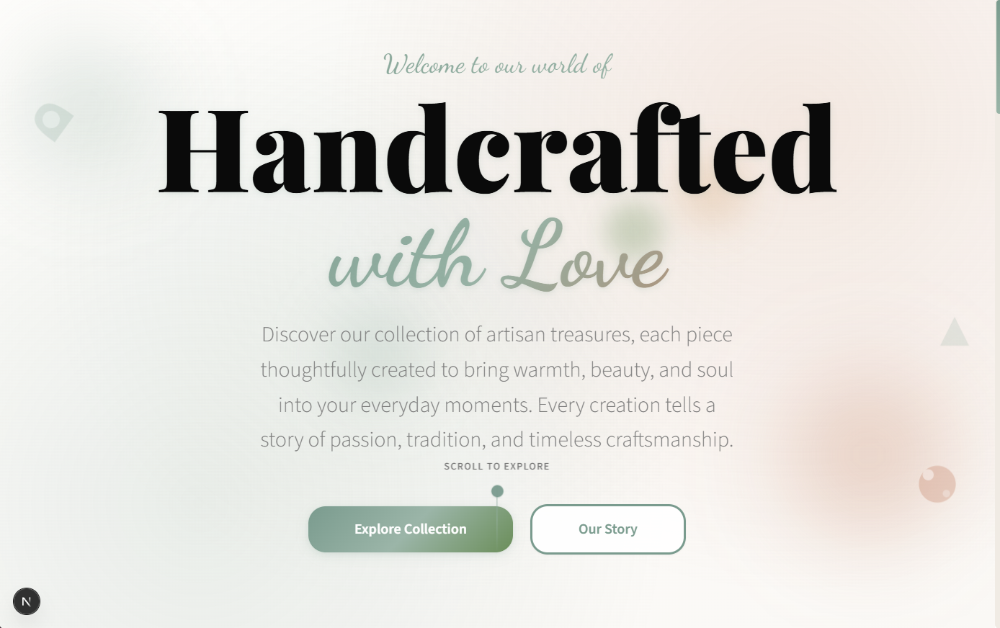

# 🪞 Artisan Luxury Landing Page

  

  

---

## ✨ Overview

A sophisticated, **high-end landing page** designed for **luxury handmade goods, boutique wellness studios, and artisan brands**.  
This demo showcases a **premium digital experience** that combines **timeless craftsmanship aesthetics** with **modern web design excellence**.

---

## 🎨 Key Features

### **Premium Visual Design**
- 🌿 **Organic Artisan Aesthetic** — warm ivory, sand, and eucalyptus green tones  
- ✒️ **Sophisticated Typography** — serif headings with elegant script accents  
- 🎭 **Soft Visual Elements** — rounded shapes and handcrafted-inspired shadows  
- 🕊 **Generous Whitespace** — airy layouts that emphasize exclusivity  

### **Interactive Product Showcase**
- 🖼 **Immersive Product Modal** with galleries + detailed descriptions  
- 👩‍🎨 **Artisan Profiles** telling the story behind each creation  
- 🛡 **Trust Indicators** — reviews, guarantees, certifications  
- ➕ **Quantity & Inventory** selection for streamlined checkout  

### **Engaging User Experience**
- ✨ **Smooth Animations** and refined hover effects  
- 🎐 **Floating Decorative Elements** that respond to movement  
- 💬 **Auto-Rotating Testimonials** with subtle transitions  
- 📊 **Interactive Stats & Counters** to highlight achievements  

### **Professional Contact System**
- 📩 **Smart Contact Modal** — separate forms for wholesale, custom, and general inquiries  
- ✅ **Real-Time Validation** with user-friendly error handling  
- ⏳ **Loading & Success States** for polished UX feedback  

### **Newsletter & Community**
- 🎁 **Welcome Offer Modal** — exclusive perks for new subscribers  
- 🌐 **Community Benefits** — early access, VIP events, exclusive content  
- 🔒 **Email Validation & Privacy Assurance**  

### **Responsive Design**
- 📱 **Mobile-First Layouts** optimized for touch interactions  
- 🧩 **Compact Card Grids** for small screens  
- ⚡ **Fast Loading & Smooth Animations** across all devices  

### **Accessibility & Performance**
- ⌨️ **Keyboard Navigation** and ARIA support  
- 🔊 **Screen Reader Friendly**  
- 🖼 **Optimized Assets** with efficient loading + hardware acceleration  

---

## 📌 Content Sections

- **Hero Section** — headline, CTA, scroll indicator  
- **Brand Story** — artisan narrative + curated imagery  
- **Product Features** — 3-column layout with iconography  
- **Customer Testimonials** — rotating authentic reviews with photos  
- **Footer** — contact info, newsletter, certifications, and trust signals  

---

## 🎯 Perfect For

- 🛍 **Luxury Handmade Goods** — pottery, jewelry, textiles, artisan crafts  
- 🧘 **Wellness Studios** — spas, yoga, holistic health  
- 🧵 **Boutique Brands** — sustainable & small-batch products  
- 🎨 **Creative Services** — design, photography, artistic portfolios  
- 🏬 **Premium Retail** — high-end lifestyle products  

---

## 🌟 Why It Works

This design **blends emotion with sophistication** — warm artisan visuals balanced with modern UX standards.  
- Builds **trust & authenticity** through storytelling  
- Highlights **quality & exclusivity** with premium layouts  
- Drives **engagement & conversions** with interactive elements  

Every pixel is crafted to **feel timeless yet innovative**, offering a **digital experience worthy of luxury brands**.  

---

  

